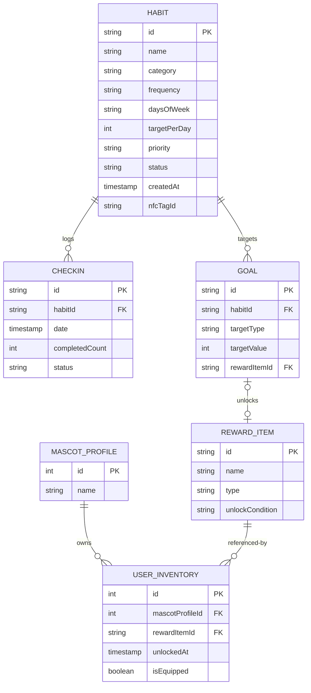

# Database Design Specification: Habit Tracker Pro

This document evaluates the alignment between [openapi.yaml](file:///D:/Documents/Job/Training/NAB-WECAMP/Capstone/Habit-Tracker-/api-documentation/openapi.yaml) and the requirements in [Capstone_Project.docx](file:///D:/Documents/Job/Training/NAB-WECAMP/Capstone/Habit-Tracker-/api-documentation/Capstone_Project.docx). It specifies the step-by-step database schema design, normalization approach, ER diagram, physical table definitions, and a feasible deployment plan for Xano.

---

## 1. OpenAPI & Requirement Gap Verification

A thorough analysis of [openapi.yaml](file:///D:/Documents/Job/Training/NAB-WECAMP/Capstone/Habit-Tracker-/api-documentation/openapi.yaml) against [Capstone_Project.docx](file:///D:/Documents/Job/Training/NAB-WECAMP/Capstone/Habit-Tracker-/api-documentation/Capstone_Project.docx) reveals the following discrepancies and missing critical logic:

### Critical Logic & Entity Gaps

1. **Mascot Equipment State (FR6, UC08):**
   - **Gap:** The document specifies a gamification system where users have a Mascot and are rewarded with decorative items when goals are reached. The coin mechanics have been completely deprecated; users receive items directly.
   - **OpenAPI Deficit:** 
     - The schemas only define a static `RewardItem` containing `id`, `name`, and `type`.
     - No schemas represent the user's `Mascot` status (e.g., current mascot name/state) or track which unlocked items are currently *Equipped* versus *Unequipped*.
     - **Recommendation:** Add a `MascotProfile` entity to track the mascot profile name and model item equipment status through `UserInventory`.
2. **NFC-Check-in Setup & Execution (UC02):**
   - **Gap:** The document specifies that users can set up NFC check-ins by linking an NFC tag with a specific habit or multiple habits.
   - **OpenAPI Deficit:** There are no endpoints or fields inside the Habit entity relating to NFC tags or identifiers (e.g., `nfcTagId`).
   - **Recommendation:** Add a nullable `nfcTagId` metadata field to the Habit entity, or model an explicit `NfcLink` table.
3. **Goal-Reward Linkage (UC08):**
   - **Gap:** The document states that when a goal reaches 100% (or 80%), a specific reward item is unlocked directly.
   - **OpenAPI Deficit:** The `Goal` and `GoalInput` schemas do not define an association to a `RewardItem`. The frontend must know which goal triggers which reward, or the backend must link them.
   - **Recommendation:** Add a foreign key or mapping relating Goals to Reward Items.

---

## 2. Step-by-Step Database Schema Design

### Step 1: Identify Entities & Generalization / Inheritance
To support the requirements without duplication of states, we define the following core entities:
* **MascotProfile:** Models the user's mascot representation and current equipped gear.
* **Habit:** Represents a tracked activity.
* **Checkin:** An execution log of a habit.
* **Goal:** A milestone targeted for a specific habit.
* **RewardItem:** Static catalog of all mascot items (10 pre-loaded items).
* **UserInventory:** Pivot entity tracking which reward items are unlocked/purchased and which ones are currently equipped.

### Step 2: Relationships & Table Mappings
* **Habit (1) ─── (N) Checkin**: A habit has multiple daily check-ins. Cascading delete is set on `habitId`.
* **Habit (1) ─── (N) Goal**: A habit can have multiple goals (e.g., streak targets and total completion targets).
* **Goal (1) ─── (0..1) RewardItem**: A goal can optionally trigger a specific mascot item reward upon completion.
* **MascotProfile (1) ─── (N) UserInventory (N) ─── (1) RewardItem**: Tracks unlocked/equipped items.

### Step 3: Many-to-Many Relationships & Attributes
* **Mascot Items Equipment State**: The relationship between the single Profile and `RewardItem` is many-to-many. The mapping table `user_inventory` has its own metadata attributes:
  - `unlockedAt` (timestamp)
  - `isEquipped` (boolean, tracking if the mascot is wearing the item)

### Step 4: Level of Normalization & Derived States
To avoid state duplication (NFR1), the database will be strictly normalized to **Third Normal Form (3NF)**:
* Streaks, total completions, completion rates, and goal progress are **never** stored in the database.
* They are computed at runtime using SQL aggregates/window functions or Xano Function Stacks from `habits` and `checkins`.
* **Index Strategy:** Composite index on `checkin(habit_id, date)` and `habit(status)` to guarantee sub-millisecond query performance on the Today screen.

---

## 3. Entity-Relationship (ER) Diagram

---

## 4. Physical Schema Definitions

### Table: `mascot_profile`
Tracks the global state of the user's mascot.

| Attribute | Data Type | Description | Constraints | Nullability | Unique |
| :--- | :--- | :--- | :--- | :--- | :--- |
| **<u>id</u>** | INT | Auto-incrementing identifier | PK | NOT NULL | YES |
| `name` | VARCHAR(100) | Name of the Mascot | DEFAULT 'Buddy' | NOT NULL | NO |

### Table: `habit`
Represents the habits managed by the user.

| Attribute | Data Type | Description | Constraints | Nullability | Unique |
| :--- | :--- | :--- | :--- | :--- | :--- |
| **<u>id</u>** | UUID/VARCHAR | Unique identifier | PK | NOT NULL | YES |
| `name` | VARCHAR(50) | Name of habit | Max 50 chars | NOT NULL | NO |
| `category` | VARCHAR(20) | Health, Study, Work, Mindfulness, Other | Enum check | NOT NULL | NO |
| `frequency` | VARCHAR(10) | Daily, Custom | Enum check | NOT NULL | NO |
| `daysOfWeek` | VARCHAR(50) | Days active (comma separated: Mon,Wed) | JSON / Text | NULL | NO |
| `targetPerDay` | INT | Daily repetitions target | >= 1 | NOT NULL | NO |
| `priority` | VARCHAR(10) | Low, Medium, High | Enum check | NOT NULL | NO |
| `status` | VARCHAR(10) | Active, Paused, Archived | Enum check | NOT NULL | NO |
| `createdAt` | TIMESTAMP | Creation timestamp | DEFAULT Now() | NOT NULL | NO |
| `nfcTagId` | VARCHAR(100) | Associated NFC metadata | | NULL | YES |

### Table: `checkin`
Records the daily progress of a habit.

| Attribute | Data Type | Description | Constraints | Nullability | Unique |
| :--- | :--- | :--- | :--- | :--- | :--- |
| **<u>id</u>** | UUID/VARCHAR | Unique identifier | PK | NOT NULL | YES |
| *habitId* | UUID/VARCHAR | Reference to the habit | FK (habit.id ON DELETE CASCADE) | NOT NULL | NO |
| `date` | TIMESTAMP | The date and time of progress tracking | Checked for no future dates | NOT NULL | NO |
| `completedCount` | INT | Total repetitions recorded | >= 0 | NOT NULL | NO |
| `status` | VARCHAR(20) | Not Started, In Progress, Completed | Derived/Set | NOT NULL | NO |

### Table: `goal`
Represents target milestones set for habits.

| Attribute | Data Type | Description | Constraints | Nullability | Unique |
| :--- | :--- | :--- | :--- | :--- | :--- |
| **<u>id</u>** | UUID/VARCHAR | Unique identifier | PK | NOT NULL | YES |
| *habitId* | UUID/VARCHAR | Reference to the target habit | FK (habit.id ON DELETE CASCADE) | NOT NULL | NO |
| `targetType` | VARCHAR(20) | Streak, TotalCompletions | Enum check | NOT NULL | NO |
| `targetValue` | INT | Value to unlock the goal | >= 1 | NOT NULL | NO |
| *rewardItemId* | UUID/VARCHAR | Associated reward item | FK (reward_item.id) | NULL | NO |

### Table: `reward_item`
Global reference of mascot decorative items.

| Attribute | Data Type | Description | Constraints | Nullability | Unique |
| :--- | :--- | :--- | :--- | :--- | :--- |
| **<u>id</u>** | UUID/VARCHAR | Unique identifier | PK | NOT NULL | YES |
| `name` | VARCHAR(100) | Item name | | NOT NULL | YES |
| `type` | VARCHAR(50) | Item slot type (e.g. Hat, Glasses) | | NOT NULL | NO |
| `unlockCondition` | TEXT | Description of how to unlock | | NOT NULL | NO |

### Table: `user_inventory`
M-N linking table showing items unlocked or equipped by the profile.

| Attribute | Data Type | Description | Constraints | Nullability | Unique |
| :--- | :--- | :--- | :--- | :--- | :--- |
| **<u>id</u>** | INT | Auto-incrementing identifier | PK | NOT NULL | YES |
| *mascotProfileId* | INT | Reference to mascot profile | FK (mascot_profile.id) | NOT NULL | NO |
| *rewardItemId* | UUID/VARCHAR | Reference to the reward item | FK (reward_item.id) | NOT NULL | NO |
| `unlockedAt` | TIMESTAMP | Timestamp of when item was earned | DEFAULT Now() | NOT NULL | NO |
| `isEquipped` | BOOLEAN | If the mascot is currently wearing this | DEFAULT FALSE | NOT NULL | NO |

---

## 5. Xano Free Account Implementation Strategy

Setting up derived states in a free Xano instance requires minimizing memory footprints and optimizing request latency since CPU limits are strictly enforced.

### Feasible Implementation Steps:
1. **Schema Setup:** Create the physical tables defined above directly inside the Xano database spreadsheet UI.
2. **Runtime Streaks & Statistics Calculation (Virtual Fields):**
   - Do **NOT** store streaks inside Xano's persistent rows. Instead, construct a **Xano Function Stack** for `GET /dashboard/summary` and `GET /habits/{id}`.
   - **Algorithm inside the Function Stack:**
     - Query check-ins ordered by `date` descending.
     - Use a **Loop** in the function stack to compute the current streak (consecutive days where `completedCount >= targetPerDay`). Break the loop as soon as a skipped day is detected.
3. **Optimizing Xano Performance on Free Tier:**
   - **Database Indexes:** In Xano, define a single composite index on `checkin` containing both `habit_id` and `date`. This prevents table scans when calculating streaks.
   - **Query Caching:** Use Xano's built-in transient cache for Dashboard summaries to prevent calculating stats on every single page navigation if nothing has changed.
